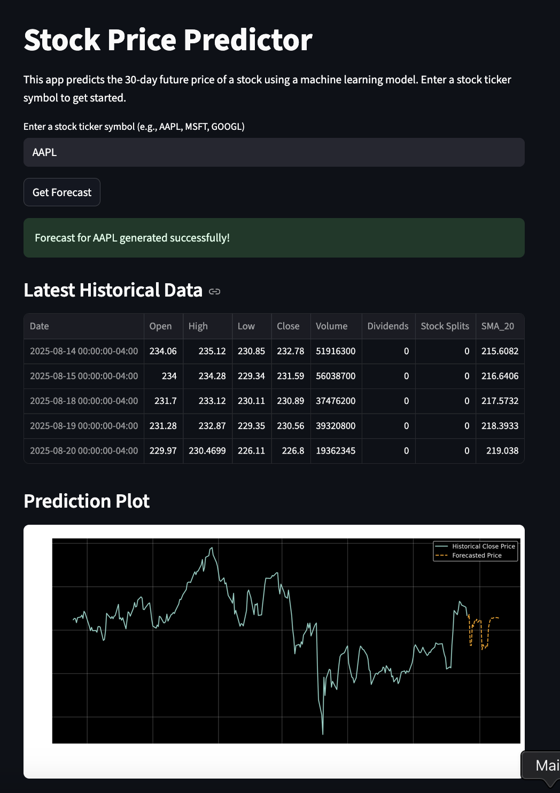

# Stock Price Predictor Web App

An interactive web application built with Python and Streamlit that forecasts future stock prices using a machine learning model. This tool allows users to enter any valid stock ticker and receive a 30-day price prediction visualized alongside historical data.



## Features

- **Interactive Web Interface:** Built with Streamlit to provide a user-friendly way to interact with the prediction model.
- **Dynamic Ticker Input:** Users can enter any stock ticker symbol to get a real-time forecast.
- **Real-Time Data:** Integrates with the Yahoo Finance API (`yfinance`) to fetch up-to-date historical stock data on demand.
- **Machine Learning Model:** Employs a `RandomForestRegressor` from Scikit-learn, trained on engineered features to predict future prices.
- **Advanced Feature Engineering:** Creates predictive features from raw data, including:
  - Simple Moving Averages (20-day and 50-day)
  - Volume Change Percentage
  - Relative Strength Index (RSI)
- **Data Visualization:** Generates and displays a clear Matplotlib chart showing the historical closing prices and the 30-day forecast.
- **Robust Error Handling:** Gracefully handles invalid ticker symbols without crashing.

## Tech Stack

- **Language:** Python
- **Web Framework:** Streamlit
- **Data Manipulation:** Pandas
- **Machine Learning:** Scikit-learn
- **Data Retrieval:** yfinance
- **Plotting:** Matplotlib

## How to Run Locally

1.  **Clone the repository:**
    ```bash
    git clone [https://github.com/mayowa2133/stock_predictor.git](https://github.com/mayowa2133/stock_predictor.git)
    cd stock_predictor
    ```

2.  **Create and activate a virtual environment:**
    ```bash
    python3 -m venv venv
    source venv/bin/activate
    ```

3.  **Install the required dependencies:**
    ```bash
    pip install -r requirements.txt
    ```

4.  **Run the Streamlit app:**
    ```bash
    streamlit run app.py
    ```
    The application will open in your web browser.