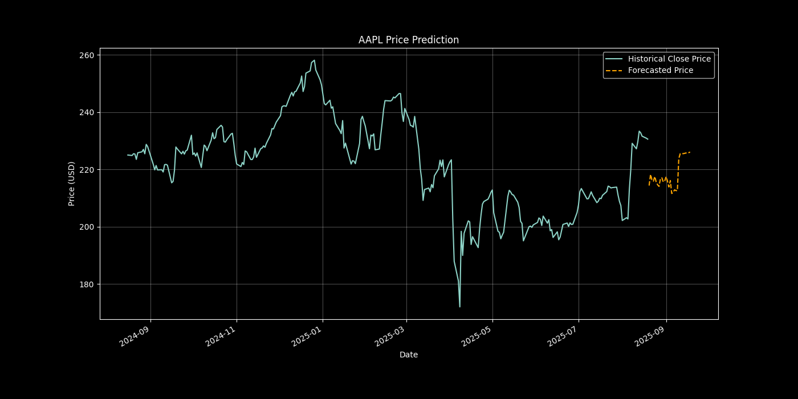

# Stock Price Predictor

A Python-based tool that leverages machine learning to forecast future stock prices. This project uses time-series analysis and regression models to analyze historical data and predict trends.

## Features

- **Real-Time Data:** Integrates with the Yahoo Finance API (`yfinance`) to fetch up-to-date historical stock data.
- **Feature Engineering:** Creates predictive features from raw data, including Simple Moving Averages (SMA) and volume metrics.
- **ML Modeling:** Employs a Scikit-learn regression model (e.g., Random Forest) to train on historical data and make future predictions.
- **Visualization:** Generates plots using Matplotlib to visualize historical prices against the model's forecast.

## Results

After training on 5 years of historical data for AAPL, the model produced the following forecast. The model's performance on the test set was:

- **Root Mean Squared Error (RMSE): $7.38**



## How to Run

1.  **Clone the repository:**
    ```bash
    git clone [https://github.com/mayowa2133/stock_predictor.git](https://github.com/mayowa2133/stock_predictor.git)
    cd stock_predictor
    ```

2.  **Create and activate a virtual environment:**
    ```bash
    python3 -m venv venv
    source venv/bin/activate
    ```

3.  **Install dependencies:**
    ```bash
    pip install -r requirements.txt
    ```

4.  **Run the script:**
    ```bash
    python src/run_prediction.py
    ```